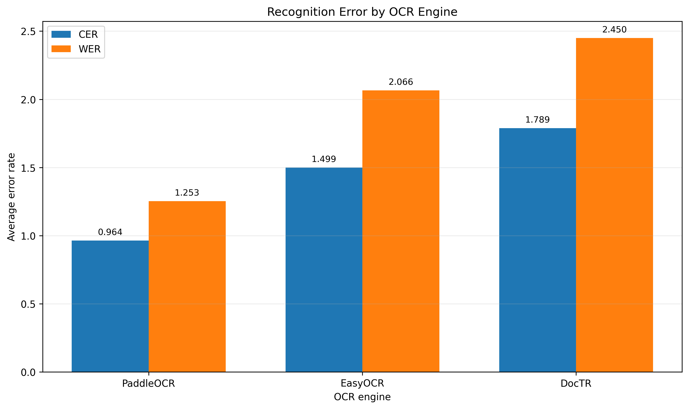
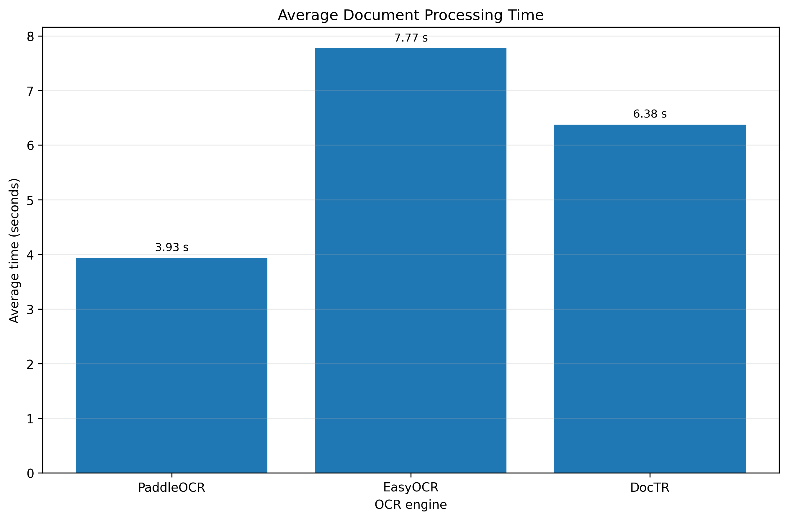
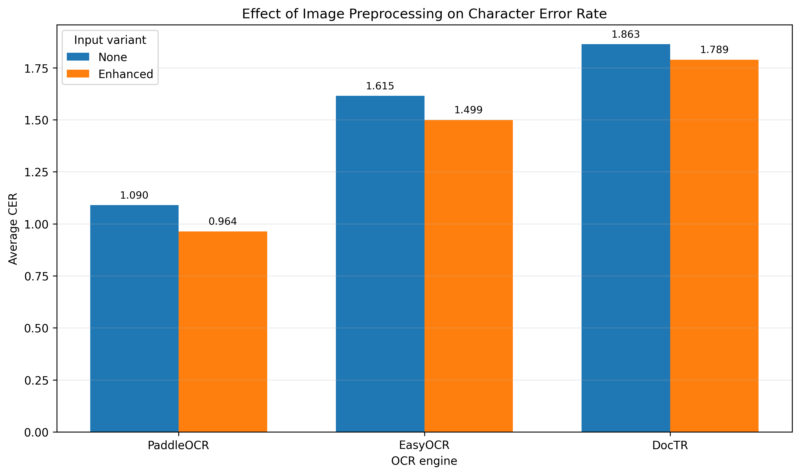
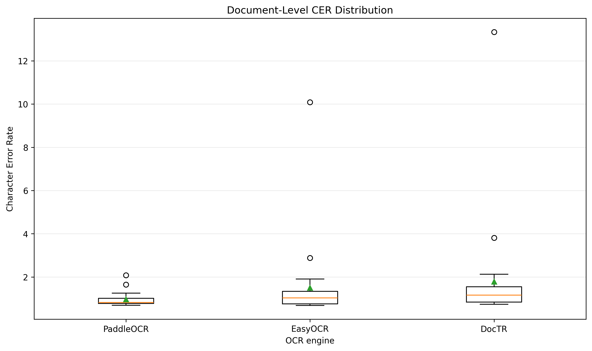

# Comparative Evaluation of Open-Source OCR Engines for Clinical Documents

Supplementary materials for the study:

> **Comparative Evaluation of Open-Source Deep Learning-Based OCR Engines for the Digitalization of Clinical Documents**

This repository contains the sanitized evaluation data, reproducibility script, aggregated results, and figures used in the conference poster.

## Authors

**Stanislava Ursulyak** and

**Javier E. Sanchez-Galan**  

---

## Study Overview

Clinical information is frequently stored in scanned or photographed documents that cannot be directly searched, analyzed, or integrated into structured healthcare information systems.

This study compares three open-source deep learning-based OCR engines:

- **PaddleOCR**
- **EasyOCR**
- **DocTR**

The objective was to identify the OCR configuration with the strongest balance of transcription accuracy, text recovery, and processing efficiency for clinical document digitalization.

---

## Experimental Design

The evaluation used:

- **25 unique clinical document images**
- **2 input variants per document**
  - Original
  - Enhanced
- **3 OCR engines**
- **150 total OCR executions**

Each document was manually transcribed to create the reference ground truth.

The engines were evaluated using:

- Character Error Rate — CER
- Word Error Rate — WER
- Reference-token recall
- Average processing time
- Successful execution rate

---

## Main Results

| OCR Engine | Selected Variant | Average CER | Average WER | Average Time | Token Recall |
|---|---|---:|---:|---:|---:|
| PaddleOCR | Enhanced | **0.9641** | **1.2527** | **3.9306 s** | 0.1561 |
| EasyOCR | Enhanced | 1.4992 | 2.0659 | 7.7711 s | 0.1467 |
| DocTR | Enhanced | 1.7889 | 2.4497 | 6.3762 s | **0.2609** |

### Main finding

**PaddleOCR with enhanced preprocessing achieved the lowest CER, lowest WER, and shortest average processing time.**

DocTR obtained the highest reference-token recall, showing a trade-off between broader text recovery and edit-distance accuracy.

All evaluated configurations completed 100% of their assigned runs.

---

## Results Visualization

### Recognition Error



### Processing Time



### Effect of Image Preprocessing



### Document-Level Variability



---

## Dataset Information

The experiment used 25 clinical document images collected from publicly accessible online sources for academic experimentation.

The documents included examples with:

- Printed and handwritten text
- Prescriptions and medical certificates
- Irregular layouts
- Signatures and stamps
- Abbreviations
- Variable image quality

Manual transcriptions were created to establish the ground-truth reference used during evaluation.

### Data availability

The original clinical document images are **not redistributed** in this repository because their redistribution rights and privacy status were not independently verified.

The repository includes only:

- Sanitized evaluation metrics
- Aggregated results
- Derived figures
- Reproducibility scripts
- Dataset methodology and description

No private institutional or hospital records are included.

---

## Repository Contents

```text
input_data/
